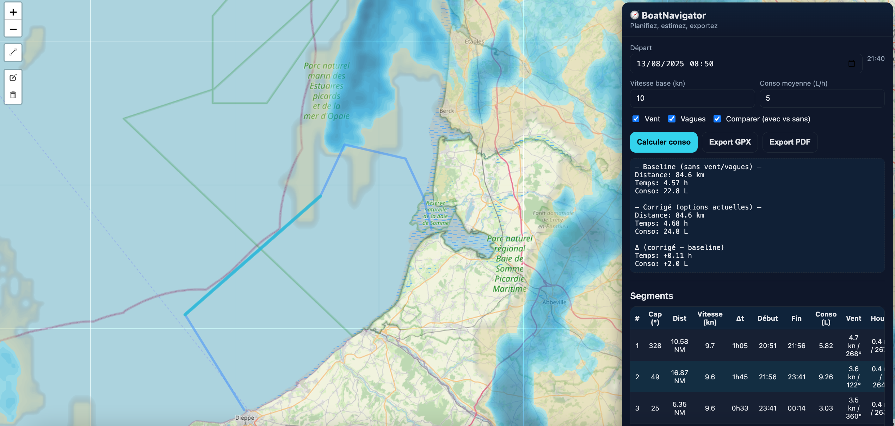

# 🚤 BoatNavigator



**BoatNavigator** est une mini-application **Flask + Leaflet** pour préparer une navigation côtière :

* tracer une **route** sur la carte,
* estimer **temps** et **consommation** (avec ou sans **vent** et **vagues**),
* afficher des **tuiles météo** : **pluie (radar)** et **flèches de vent**,
* **exporter** un **GPX** horodaté et un **PDF** récapitulatif (carte + tableau des segments).

---

## ✨ Fonctionnalités

* 🗺️ **Tracé interactif** de la route (Leaflet.draw)
* 🔢 **Calcul conso** à partir d’un **L/h** moyen fourni
* 🌬️🌊 **Météo dans le calcul** : vent 10 m (**Open-Meteo Forecast**) + houle (**Open-Meteo Marine**) par segment
* ⚖️ **Comparaison** : **baseline** (sans météo) vs **corrigé** (vent/vagues activables par cases à cocher)
* 🌧️ **Tuiles pluie (radar nowcast)** via **RainViewer** (slider temporel) – **sans clé**
* 🧭 **Flèches de vent** (champ interpolé depuis Open-Meteo) – **sans clé**
* 🧾 **Exports** :

  * **GPX** (trace + timestamps selon ETA),
  * **PDF** (schéma lat/lon + **tableau des segments** : cap, distance, ETA, vitesse, conso).

### Modèle conso (simple et réglable)

Pour chaque segment $i$ :

$$v_i = v_0\,[1 - \alpha \tfrac{U_{\parallel}}{U_\mathrm{ref}} - \beta \tfrac{H_s}{H_\mathrm{ref}}\cos^2(\theta_\text{houle})]_+,\quadC_i = C_0\,[1 + \gamma \tfrac{\max(U_{\parallel},0)}{U_\mathrm{ref}} + \delta \tfrac{H_s}{H_\mathrm{ref}}]$$

avec $U_{\parallel} = U\cos\theta$ (vent de face positif), et paramètres $\alpha,\beta,\gamma,\delta$ ajustables.

---

## 📦 Installation

```bash
git clone https://github.com/<votre-compte>/BoatNavigator.git
cd BoatNavigator
python -m venv .venv
source .venv/bin/activate
pip install -r requirements.txt
```

**requirements.txt** (exemple) :

```
Flask==3.0.3
requests==2.32.3
numpy==1.26.4
reportlab==4.2.0
matplotlib==3.9.0
```

---

## ▶️ Lancer

```bash
python app.py
# Ouvrez http://127.0.0.1:5000
```

---

## 🖥️ Utilisation (UI)

1. **Tracez** la route (outil polyligne) sur la carte.
2. Saisissez **date/heure de départ**, **vitesse de base (kn)**, **conso moyenne (L/h)**.
3. Activez/désactivez **Vent** et/ou **Vagues** (pour comparaison).
4. Cliquez **Calculer conso** → affiche **distance**, **temps**, **litres**.
5. Tuiles météo :

   * **Pluie** : cochez *Pluie (RainViewer)*, utilisez le **slider** temporel.
   * **Vent** : cochez *Vent (Open-Meteo)*, slider 0..48 h → **flèches** colorées par vitesse.
6. Exports : **Export GPX** / **Export PDF**.

---

## 🧱 Architecture (bref)

```
BoatNavigator/
├─ app.py                # Flask app + endpoints API/exports
├─ static/
│  └─ index.html         # UI Leaflet + contrôles + météo
├─ requirements.txt
└─ README.md
```

### Endpoints principaux

* `POST /api/consumption`
  **Entrée** :

  ```json
  {
    "route":{"type":"LineString","coordinates":[[lon,lat], ...]},
    "start_iso":"2025-08-15T09:00:00Z",
    "base_speed_kn":10.0,
    "lph":5.0,
    "model":{"Uref":10,"Href":1,"alpha":0.08,"beta":0.10,"gamma":0.15,"delta":0.10},
    "use_wind":true,
    "use_waves":true,
    "mode":"both"   // "baseline" | "corrected" | "both"
  }
  ```

  **Sortie** : `{"baseline":{...}, "corrected":{...}, "delta":{...}}` (selon `mode`).

* `POST /api/windfield`
  Retourne un **champ de vent** interpolé (grille autour du viewport). **Sans clé** ; inclut un **cache** pour éviter le 429.
  **Entrée** :

  ```json
  {
    "bbox":[minLon, minLat, maxLon, maxLat],
    "offset_h": 0,
    "grid":{"nx":5,"ny":5}
  }
  ```

  **Sortie** : `{"vectors":[{"lat":..,"lon":..,"speed_kn":..,"dir_from_deg":..},...], "ts_iso":"...Z"}`.

* `POST /export/gpx` → téléchargement `navigation.gpx`

* `POST /export/pdf` → téléchargement `navigation.pdf`

---

## 🧪 Exemples (cURL)

### Calcul consommation (both)

```bash
curl -X POST http://127.0.0.1:5000/api/consumption \
  -H 'Content-Type: application/json' \
  -d '{
    "route":{"type":"LineString","coordinates":[[-2.99,47.56],[-2.85,47.62]]},
    "start_iso":"2025-08-15T09:00:00Z",
    "base_speed_kn":10,"lph":5,
    "use_wind":true,"use_waves":true,"mode":"both"
  }'
```

### Champ de vent (viewport exemple)

```bash
curl -X POST http://127.0.0.1:5000/api/windfield \
  -H 'Content-Type: application/json' \
  -d '{"bbox":[-3.2,47.4,-2.5,47.8], "offset_h": 3, "grid":{"nx":5,"ny":5}}'
```

---

## ✅ État d’avancement

* [x] Tracé d’itinéraire
* [x] Calcul conso (baseline & corrigé vent/vagues)
* [x] Tuiles pluie (RainViewer) – slider
* [x] Flèches de vent (Open-Meteo) – slider
* [x] Exports GPX & PDF
* [x] Liste **interactive** des segments dans l’UI (cap/dist/ETA/vitesse/conso)
* [x] **Interpolation temporelle** des prévisions (au lieu du snap horaire)
* [ ] **Alertes** (seuils vent/houle)
* [ ] **Sauvegarde/chargement** de routes (localStorage/JSON)
* [ ] Cache disque et/ou persistant


---

## 📄 Licence

MIT (à adapter selon vos besoins).

